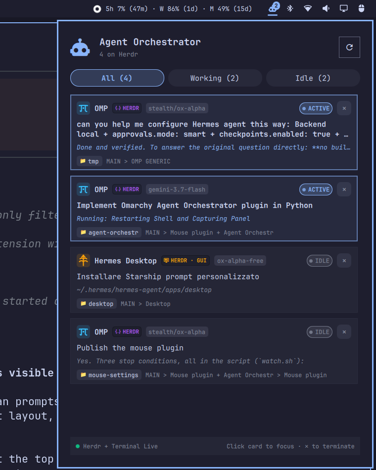

# Agent Orchestrator for Omarchy

Real-time status, active tasks, and one-click workspace switching for AI coding agents (**Herdr**, **OMP**, **Hermes**, **Claude**, **Codex**, **OpenCode**) in the Omarchy bar.



## Features

- **Live Multi-Source Agent Tracking**: Seamlessly tracks AI coding agents across **Herdr** daemon panes (`~/.config/herdr/herdr.sock`), standalone terminal windows (Ghostty, Foot, Kitty, Alacritty, WezTerm), **OMP** sessions (`~/.omp/agent/sessions/`), and **Hermes** CLI & Desktop app databases (`~/.hermes/state.db`).
- **One-Click Workspace & Window Switching**: Click any agent card to switch Hyprland workspaces and focus the exact terminal window, Herdr pane, or Hermes Desktop window.
- **Visual Status Bar Display**:
  - **`Icon` Mode**: Agent orchestrator glyph with dynamic activity badge and spinner animation when agents are actively working.
  - **`Status` Mode**: Real-time ticker showing active task descriptions or prompt summaries.
  - **`Compact` Mode**: Live count summary (e.g. `4 ag · 1 busy`, `3 done`).
- **Interactive Popup Panel**:
  - **Smart Filter Tabs**: Filter by `All`, `Working`, `Waiting` (user input needed), `Done` (completed tasks), and `Idle`.
  - **Rich Agent Cards**: Model tags, latest human prompt, real-time tool execution details, repository / working directory breadcrumbs, and active session indicators.
  - **Process Management**: Safely terminate agent processes or close Herdr panes directly from card action buttons.
  - **Privacy First**: Automatic redaction of sensitive API keys and tokens from display prompts and status messages.
  - **Adaptive Fast Polling**: 1s live refresh while popup is open or agents are working; configurable interval when idle.
## Installation

### Via Omarchy Marketplace / Plugin Manager

```bash
omarchy plugin add https://github.com/meviusisback/agent-orchestr --enable
```

### Manual Installation

Clone or symlink this repository into your Omarchy plugins directory:

```bash
mkdir -p ~/.config/omarchy/plugins
ln -sfn ~/repo/agent-orchestr ~/.config/omarchy/plugins/meviusisback.agent-orchestr
```

Then add `"meviusisback.agent-orchestr"` to your status bar layout in `~/.config/omarchy/shell.json`:

```json
{
  "id": "meviusisback.agent-orchestr",
  "barDisplay": "Icon",
  "refreshIntervalSec": 3
}
```

And restart the shell:

```bash
omarchy restart shell
```

## Removal

```bash
omarchy plugin remove meviusisback.agent-orchestr
```

Or manually remove the symlink/directory from `~/.config/omarchy/plugins/meviusisback.agent-orchestr` and remove `"meviusisback.agent-orchestr"` from `~/.config/omarchy/shell.json`.

## Keybinding

You can toggle the popup panel with a global Hyprland keyboard shortcut.

Add the following to `~/.config/hypr/bindings.lua`:

```lua
o.bind("SUPER + A", "Agent Orchestrator", "omarchy shell meviusisback.agent-orchestr toggle")
```

### Shell IPC Commands

```bash
# Toggle popup panel
omarchy shell meviusisback.agent-orchestr toggle

# Explicit open / close
omarchy shell meviusisback.agent-orchestr open
omarchy shell meviusisback.agent-orchestr close

# Force refresh live status
omarchy shell meviusisback.agent-orchestr refresh
```
## Settings

| Key | Default | Description |
|---|---|---|
| `barDisplay` | `"Icon"` | `"Icon"`, `"Status"`, or `"Compact"` |
| `refreshIntervalSec` | `3` | Polling frequency in seconds |
| `showIdleInBar` | `false` | Whether to display badge count when all agents are idle |
| `maxTaskLength` | `45` | Maximum characters shown in the bar status ticker |

## License

MIT
